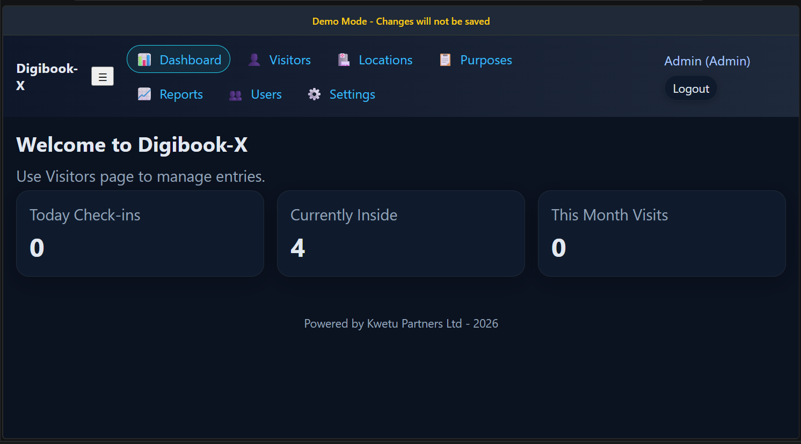
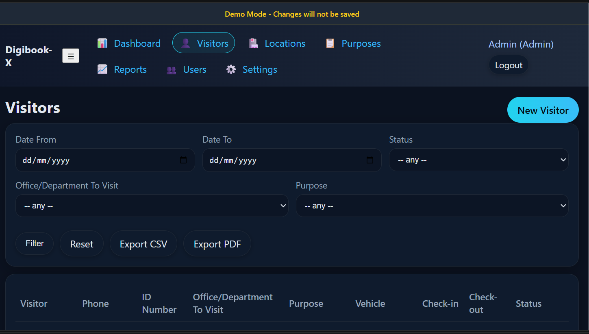
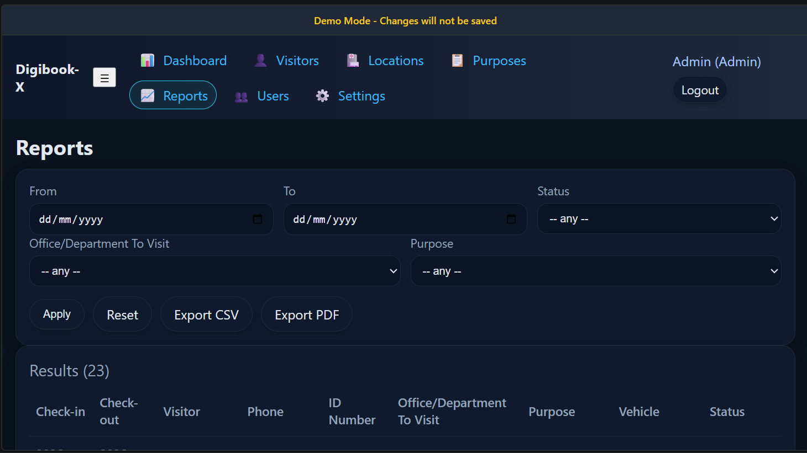
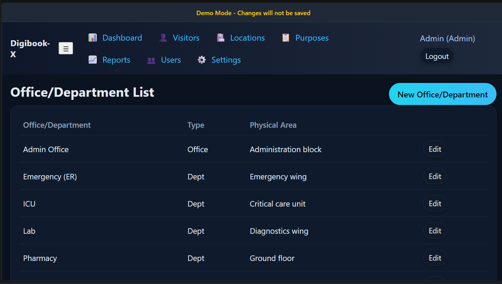

# Digibook-X™ — Visitor & Reception Management System

Digibook-X™ is a professional visitor and reception management system designed to digitize front desk operations, improve visitor tracking, and modernize organizational check-in processes.

Built for offices, institutions, residential facilities, and operational environments requiring structured visitor visibility and reception control.

---

## 🚀 Overview

Digibook-X™ replaces traditional paper visitor books with a structured digital platform that improves operational efficiency, accountability, and visitor monitoring.

The system enables reception teams and administrators to:

- Register visitors digitally
- Track check-ins and exits
- Monitor active visitors inside premises
- Organize visitor purposes and destinations
- Generate operational visibility reports
- Centralize front desk management

This demo version is configured for safe public showcasing with demo-mode protections enabled.

---

## 🧠 Core Features

- Visitor Check-In & Check-Out Management
- Reception Dashboard Analytics
- Visitor Purpose Management
- Location/Department Tracking
- User Management
- Visitor Reporting
- Operational Audit Visibility
- Mobile-Friendly Interface
- Demo Protection Mode
- Structured Front Desk Workflow

---

## 📸 System Screenshots

### Dashboard



---

### Visitor Management



---

### Reports



---

### Locations Management



---

## 🛠️ Tech Stack

### Backend

- Python
- Flask

### Frontend

- HTML
- CSS
- JavaScript

### Database

- SQLite

---

## ⚙️ Installation

### 1. Clone Repository

```bash
git clone https://github.com/kwetu-stack/Digibook-x.git
cd Digibook-x
2. Create Virtual Environment
Windows
python -m venv .venv
.venv\Scripts\activate
Mac/Linux
source .venv/bin/activate
3. Install Requirements
pip install -r requirements.txt
4. Configure Environment

Copy:

.env.example

to:

.env

Then update environment values if needed.

5. Run Application
python app.py
6. Access System
http://127.0.0.1:5000
💼 Operational Use Cases

Digibook-X™ is suitable for:

Corporate Offices
Reception Desks
Residential Estates
Schools & Institutions
Construction Sites
Hospitals & Clinics
Government Offices
Warehouses & Logistics Facilities
🔒 Demo Mode

This public demo version is configured with safe demo protections.

Changes made through the live demo interface are not permanently saved.

📈 Roadmap
v1.1
QR Visitor Passes
Photo Capture Support
Visitor Badge Printing
v2.0
Multi-Branch Support
Real-Time Notifications
Email/SMS Visitor Alerts
v2.1
Full SaaS Deployment
Role-Based Access Control
Cloud Analytics Dashboard
👤 Author

Bundi Murithi
Founder & Software Engineer
Kwetu Partners Ltd

🌍 About Kwetu Partners

Kwetu Partners builds operational business systems focused on:

Inventory Management
Logistics & Dispatch
Visitor & Reception Management
Construction Management
Education Technology
Identity & Access Systems

Kwetu follows a Monozukuri-inspired engineering philosophy centered on craftsmanship, operational clarity, and long-term system reliability.

Website:

https://kwetupartners.net/

📄 License

MIT License — Free to use, modify, and distribute.

🌐 Built in Kenya

Designed and engineered by Kwetu Partners Ltd.

Focused on solving practical operational challenges across emerging markets.